A Pod is a single instance of an application.   
A POD is the smallest object that you can create in Kubernetes.   
A Pod can contain one or more containers.   
The containers in a Pod share the same network namespace, which means they can communicate with each other using localhost.   
Pods are ephemeral, meaning they can be created and destroyed as needed.

ReplicaSet - A replicaSet will maintain a stable set of replica Pods running at any given time. It is used to guarantee the availability of a specified number of identical Pods. 

Deployment - A deployment runs multiple replicas of your application and automatically replaces any instances that fail or become unresponsive. It provides declarative updates to Pods and ReplicaSets.  
It is well-suited for stateless applications.

Service - A service is an abstraction for Pods providing a stable virtual IP VIP address. The service sits in front of a POD and acts as a load balancer.

Kubernetes - Imperative and Declarative.

Imperative - Meaning deploying using kubectl.

Declarative - Meaning deploying using yaml file and kubectl apply.
### Pod.
In Kubernetes the target is to deploy the application in the form of container on worker nodes in the cluster.   
The container image is needed. The container is encapsulated in Pods.  
A pod is a single instance of an application - Meaning in case the target to get 10 instance of the application then we need to create 10 pods.
Pod have one to one relationship with container. To scale up we create new pod and to scale down we delete the pod.  
There will be no 2 container in single pod with same purpose like there will be no 2 application instance inside pod of same purpose in single pod.   

When to increase the pod then increase the replica count and it will increase the pod.

There can be multiple container in single pod - they are not of same type.

In pod there will be the application instance and a helper container - Sidecar - They act as data pullers - Pull data needed by main container and data pusher - push data like logs to external system - Proxies - Writes static data to html files using helper container and read using main container.
The containers inside pods communication within the same network space and they share the same storage space.


Imperative Pod deployment.

Connect the kubectl to the GKE cluster. In the kubernetes there should be a cluster created. There connect get the code.
```shell
gcloud container clusters get-credentials <CLUSTER_NAME> --region <REGION> --project <PROJECT_ID>

gcloud container clusters get-credentials standard-public-cluster-1 --region us-central1 --project kdaida123

kubectl get nodes 

kubectl get pods 

kubectl run my-first-pod --image stacksimplify/kubenginx:1.0.0

kubectl get pods
#NAME            READY   STATUS              RESTARTS   AGE
#my-first-pod    1/1     ContainerCreating   0          98s

kubectl get po -o wide

#NAME           READY   STATUS    RESTARTS   AGE   IP          NODE                NOMINATED NODE   READINESS GATES
#my-first-pod   1/1     Running   0          69s   10.124.1.5  gke-standard-pub    <none>           <none>

```

`kubectl run my-first-pod --image stacksimplify/kubenginx:1.0.0` meaning create the pop name `my-first-pod` and pull the docker image and create the container in the pod and start the container.

When set up the application inside the worker node then the application is accessed to the worker node.  
To access the application we need see the worker node and to access externally we need to create **NodePort** or **Load balancer Service**.  
The application needs to be downloaded in the web browser.

### Kubernetes Services - Loadbalancer.

We can expose an application running on a set of PODs using different types of Services available in k8s.

• ClusterIP Service (Expose the application as a pod internal to k8s cluster)
• NodePort Service (Internet + internal)
• LoadBalancer Service (Internet + internal)
• Ingress Service (Internet + internal)

**LoadBalancer Service** - • To access our application outside of Google GKE k8s cluster, we can use Kubernetes LoadBalancer service which will be eventually mapped to Google Cloud Load Balancer.

• When we deploy k8s load balancer service in GKE Cluster, the following will be created

• Google Cloud Load Balancer
• Google Cloud External IP

The step include create the pod and expose the pod as a service with the type and port and name. 

```yml
kubectl get pods
# NAME           READY   STATUS    RESTARTS   AGE
# my-first-pod   1/1     Running   0          9s

kubectl expose pod my-first-pod --type=LoadBalancer --port=80 --name=my-first-service
#service/my-first-service exposed

kubectl get service
# NAME               TYPE           CLUSTER-IP   EXTERNAL-IP   PORT(S)        AGE
# kubernetes         ClusterIP      10.0.0.1     <none>        443/TCP        3d1h
# my-first-service   LoadBalancer   10.0.8.232   <pending>     80:31317/TCP   11s

kubectl get svc
# NAME               TYPE           CLUSTER-IP   EXTERNAL-IP   PORT(S)        AGE
# kubernetes         ClusterIP      10.0.0.1     <none>        443/TCP        3d1h
# my-first-service   LoadBalancer   10.0.8.232   34.123.61.239     80:31317/TCP   44s

```
To verify `console - Kubernetes Engine - Services and Ingress - the services are created - the endpoint ip address (external Ip) that host the application`  
In the `console - network service - loadbalancer - the application will be showing` The connection will be TCP - Kubernetes load balancer creates the TCP connection to the application.

Important pods command.

```yaml
kubectl logs my-first-pod
```

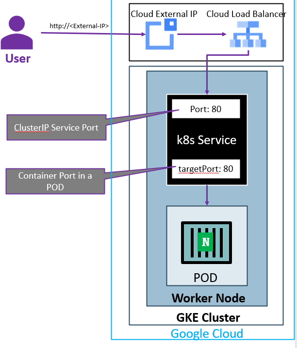

GKE Private Cluster - Understand technology like VPC peering, private IP, public IP, NAT gateway, firewall rules, etc.

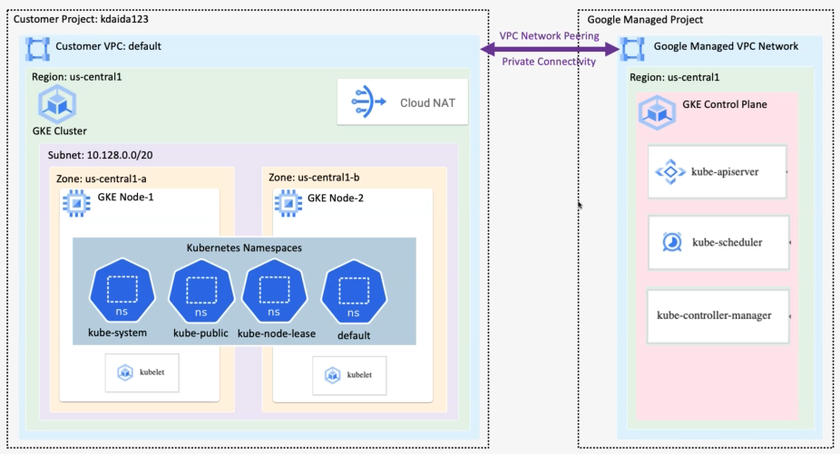

GKE Storage - Kubernetes storage concept - Understand about the storage classes, persistent volume, persistent volume claim, dynamic provisioning, etc. GCE persistent disk as a storage disk for implementation.

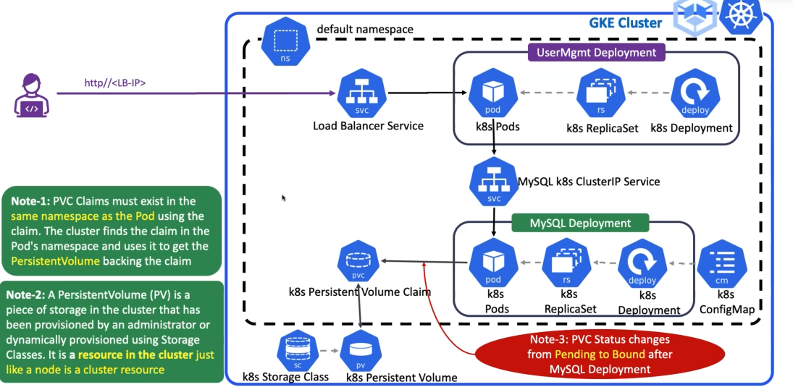

Implementation then we proceed with volume snapshot.

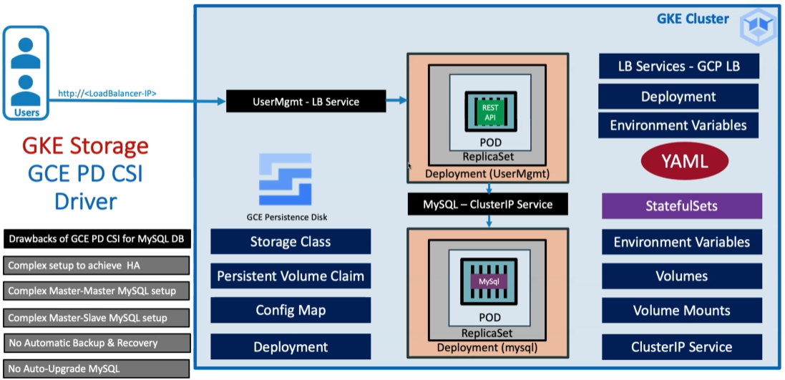

Use of the db Google cloud Cloud SQL and not the persistent disk CSI Driver.

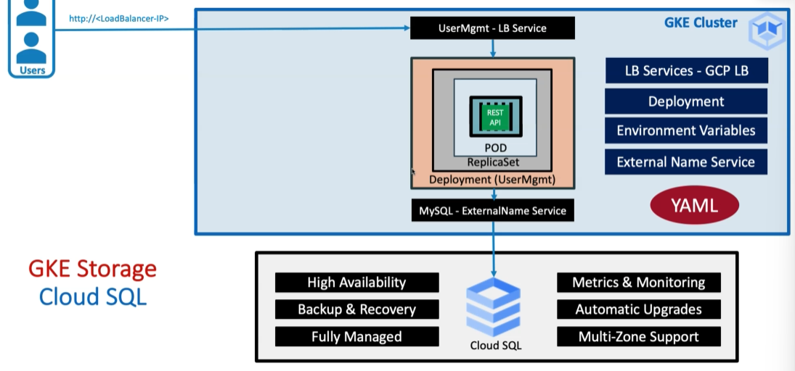

Then the next step to move with the GKE And Cloud SQL public IP.

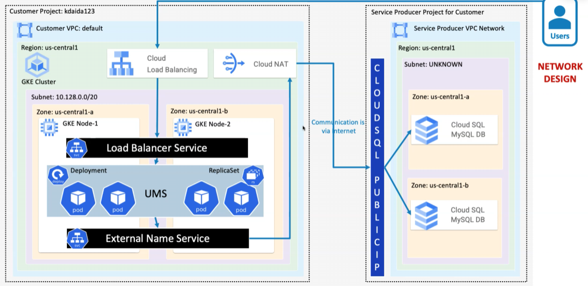

Then the next step to move with the GKE And Cloud SQL private service access.

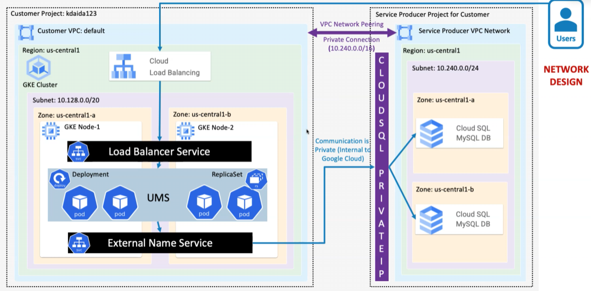


When it is done will proceed with FileStore and GKE, Volume restore.


Understand the Loadbalancer later - L4 and L7.

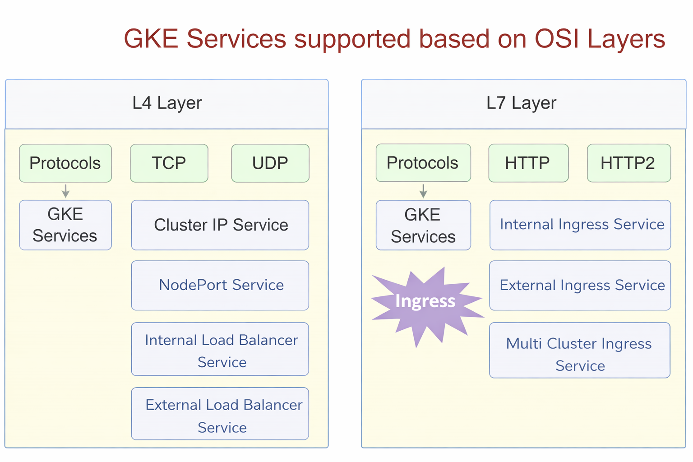
The ingress is a big topic.
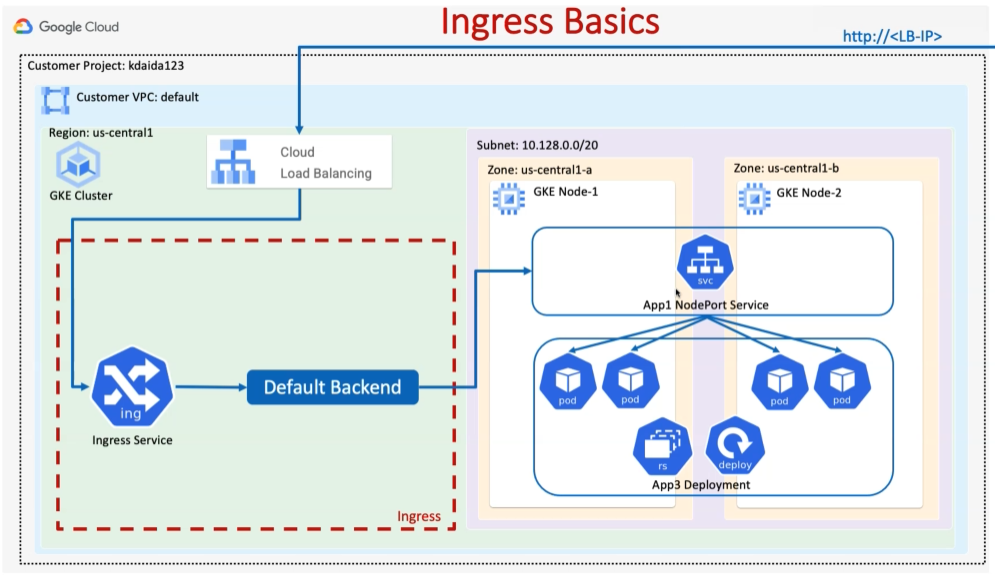

<br>

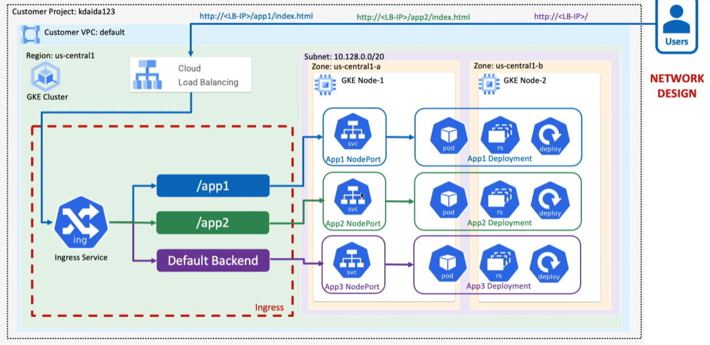

<br>

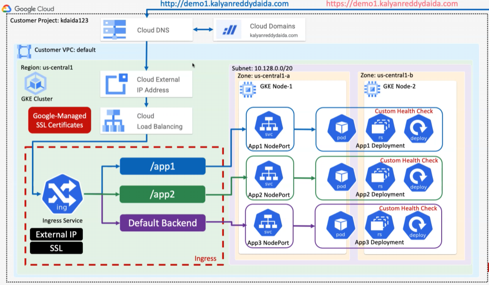


### SSL Policies

SSL policies specify the set of SSL features that Google Cloud load balancers use when negotiating SSL with clients.

| **Policy Type** | **Description** |
|------------------|-----------------|
| **COMPATIBLE** | Allows the broadest set of clients, including those that support only outdated SSL features. |
| **MODERN** | Supports a wide set of SSL features, allowing modern clients to negotiate SSL securely. |
| **RESTRICTED** | Supports a reduced set of SSL features, intended to meet stricter compliance requirements. |
| **CUSTOM** | Lets you select SSL features individually for fine‑grained control. |


GKE cluster mode - **GKE standard cluster, GKE autopilot cluster**.

GKE Standard cluster - It will be both public and private cluster. When using the cluster we need the compute engine like the storage snapshots, storage image and the compute engine.

GKE public cluster then private cluster. In private cluster we have the VPC network peering, private connectivity and pull docker images.


The clusters will be in different cluster types.  
GKE zonal Cluster or GKE Regional Cluster.  
GKE Public Custer or GKE Private Cluster.  
GKE Alpha Cluster or GKE Cluster using Node Pools.

### GKE Standard Cluster Architecture.

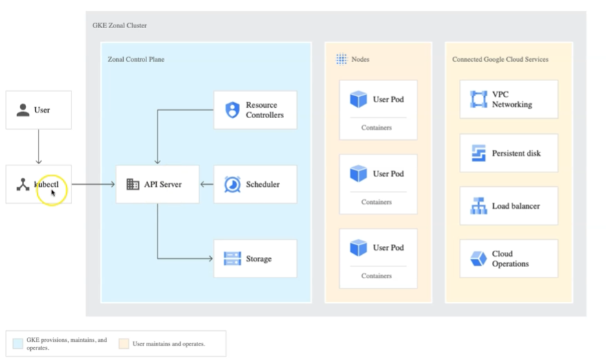
*Figure: GKE Standard Cluster Architecture*

User will use the kubectl and connect to the Zonal Control Plane.

The Zonal Control Plane are maintained by the GKE provision and the Nodes by the user. 

Sample - Create a standard GKE cluster - Configure the Google CloudShell to access GKE cluster and deploy kubernetes deployment and load balancer service.

Console - kubernetes engine - select nodes boot disk type.

Boot disk 3 types - Standard persistent disk, SSD persistent disk, Balanced persistent disk.

There are nodes and node pool - say 3 node pool in the cluster page and it will be visible in the compute engine vm instances.

In the workload section we will be seeing the workload deployed using kubectl.
The services and application packaged to the kubernetes will be deployed.
### GKE Autopilot Cluster Architecture.

The Autopilot control plane and the nodes are maintained by GKE and user deploy the workload.

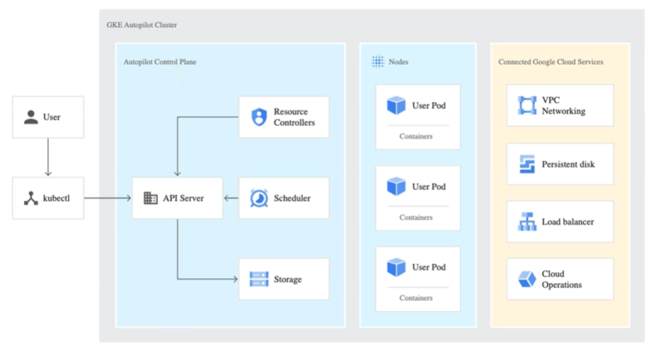

Autoscaling on the nodes will be taken care by the autopilot cluster.

## Kubernetes Architecture.

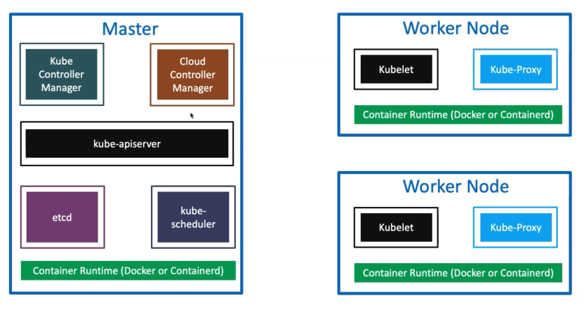

In every worker node there will be kubelet and kube-proxy.

#### Master Node.
**kube-apiserver** - It acts as front end for the Kubernetes control plane. It exposes the _Kubernetes API_.

Command line tools (like kubectl), Users and even Master components (scheduler, controller manager, etcd) and Worker node components like (Kubelet) everything talk with API Server.

**etcd** - Consistent and highly-available key value store used as Kubernetes’ backing store for all cluster data.

It stores all the masters and worker node information. It acts as a db of the cluster.

**kube-scheduler** - Scheduler is responsible for distributing containers across multiple nodes.

It watches for newly created Pods with no assigned node, and selects a node for them to run on. 

Schedule the pod in the worker node and the kube-scheduler plays an key role.

**kube-controller-manager** - Controllers are responsible for noticing and responding when nodes, containers or endpoints go down. They make decisions to bring up new containers in such cases.

Node Controller - Responsible for noticing and responding when nodes go down.

Replication Controller - Responsible for maintaining the correct number of pods for every replication controller object in the system.

Endpoints Controller - Populates the Endpoints object (that is, joins Services & Pods).

Service Account & Token Controller - Creates default accounts and API Access for new namespaces.

**Cloud-controller-manager** - A Kubernetes control plane component that embeds cloud-specific control logic.
• It only runs controllers that are specific to your cloud provider. It is not present in on-premise kubernetes cluster. It is present for control planes GKE, AWS.
• On-Premise Kubernetes clusters will not have this component.
• Node controller: For checking the cloud provider to determine if a node has been deleted in the cloud after it stops responding
• Route controller: For setting up routes in the underlying cloud infrastructure
• Service controller: For creating, updating and deleting cloud provider load balancer
• Many more controllers might be present and will differ from cloud to cloud based on that respective cloud Kubernetes Platform design and Integrations to their Cloud products.

#### Worker Node.

**Container Runtime** - Container Runtime is the underlying software where all Kubernetes components run.
In GKE, the default runtime is containerd, but there are also options such as - Ubuntu with Containerd, Ubuntu with Docker, Windows.  
In the cluster node pool the nodes will show the container option.


**Kubelet** - Kubelet is the agent that runs on every node in the cluster.
This agent is responsible for making sure that containers are running in a Pod on a node.

**Kube-Proxy** - It is a network proxy that runs on each node in your cluster.
It maintains network rules on nodes.
In short, these network rules allow network communication to your Pods from network sessions inside or outside of your cluster.

#### Pods.


#### ReplicaSet.

#### Deployment.

#### Service.