A Pod is a single instance of an application.   
A POD is the smallest object that you can create in Kubernetes.   
A Pod can contain one or more containers.   
The containers in a Pod share the same network namespace, which means they can communicate with each other using localhost.   
Pods are ephemeral, meaning they can be created and destroyed as needed.

ReplicaSet - A replicaSet will maintain a stable set of replica Pods running at any given time. It is used to guarantee the availability of a specified number of identical Pods. 

Deployment - A deployment runs multiple replicas of your application and automatically replaces any instances that fail or become unresponsive. It provides declarative updates to Pods and ReplicaSets.  
It is well-suited for stateless applications.

Service - A service is an abstraction for Pods providing a stable virtual IP VIP address. The service sits in front of a POD and acts as a load balancer.

Kubernetes - Imperative and Declarative.

Imperative - Meaning deploying using kubectl.

Declarative - Meaning deploying using yaml file and kubectl apply.

### SSL Policies

SSL policies specify the set of SSL features that Google Cloud load balancers use when negotiating SSL with clients.

| **Policy Type** | **Description** |
|------------------|-----------------|
| **COMPATIBLE** | Allows the broadest set of clients, including those that support only outdated SSL features. |
| **MODERN** | Supports a wide set of SSL features, allowing modern clients to negotiate SSL securely. |
| **RESTRICTED** | Supports a reduced set of SSL features, intended to meet stricter compliance requirements. |
| **CUSTOM** | Lets you select SSL features individually for fine‑grained control. |


GKE cluster mode - **GKE standard cluster, GKE autopilot cluster**.

GKE Standard cluster - It will be both public and private cluster. When using the cluster we need the compute engine like the storage snapshots, storage image and the compute engine.

GKE public cluster then private cluster. In private cluster we have the VPC network peering, private connectivity and pull docker images.


The clusters will be in different cluster types.  
GKE zonal Cluster or GKE Regional Cluster.  
GKE Public Custer or GKE Private Cluster.  
GKE Alpha Cluster or GKE Cluster using Node Pools.

### GKE Standard Cluster Architecture.

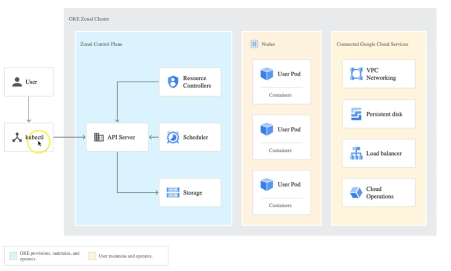
*Figure: GKE Standard Cluster Architecture*

User will use the kubectl and connect to the Zonal Control Plane.

The Zonal Control Plane are maintained by the GKE provision and the Nodes by the user. 

Sample - Create a standard GKE cluster - Configure the Google CloudShell to access GKE cluster and deploy kubernetes deployment and load balancer service.

Console - kubernetes engine - select nodes boot disk type.

Boot disk 3 types - Standard persistent disk, SSD persistent disk, Balanced persistent disk.

There are nodes and node pool - say 3 node pool in the cluster page and it will be visible in the compute engine vm instances.

In the workload section we will be seeing the workload deployed using kubectl.
The services and application packaged to the kubernetes will be deployed.
### GKE Autopilot Cluster Architecture.

The Autopilot control plane and the nodes are maintained by GKE and user deploy the workload.

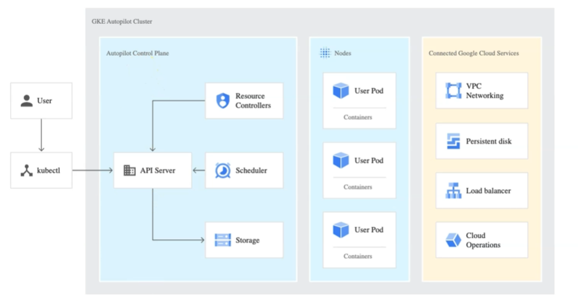

Autoscaling on the nodes will be taken care by the autopilot cluster.

## Kubernetes Architecture.

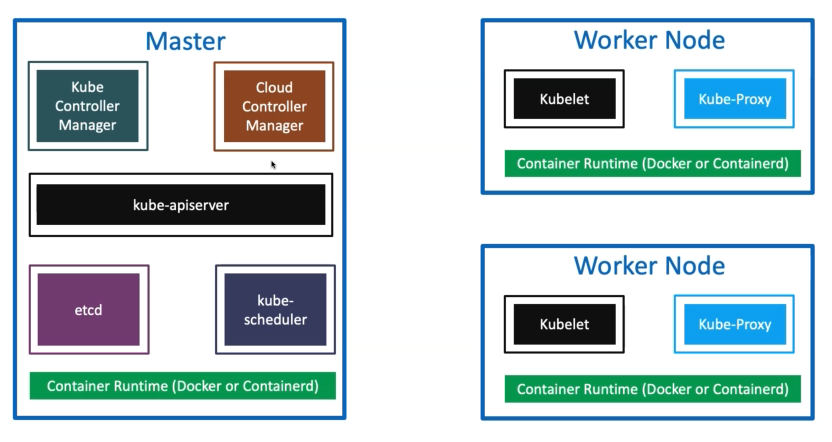

In every worker node there will be kubelet and kube-proxy.

#### Master Node.
**kube-apiserver** - It acts as front end for the Kubernetes control plane. It exposes the _Kubernetes API_.

Command line tools (like kubectl), Users and even Master components (scheduler, controller manager, etcd) and Worker node components like (Kubelet) everything talk with API Server.

**etcd** - Consistent and highly-available key value store used as Kubernetes’ backing store for all cluster data.

It stores all the masters and worker node information. It acts as a db of the cluster.

**kube-scheduler** - Scheduler is responsible for distributing containers across multiple nodes.

It watches for newly created Pods with no assigned node, and selects a node for them to run on. 

Schedule the pod in the worker node and the kube-scheduler plays an key role.

**kube-controller-manager** - Controllers are responsible for noticing and responding when nodes, containers or endpoints go down. They make decisions to bring up new containers in such cases.

Node Controller - Responsible for noticing and responding when nodes go down.

Replication Controller - Responsible for maintaining the correct number of pods for every replication controller object in the system.

Endpoints Controller - Populates the Endpoints object (that is, joins Services & Pods).

Service Account & Token Controller - Creates default accounts and API Access for new namespaces.

**Cloud-controller-manager** - A Kubernetes control plane component that embeds cloud-specific control logic.
• It only runs controllers that are specific to your cloud provider. It is not present in on-premise kubernetes cluster. It is present for control planes GKE, AWS.
• On-Premise Kubernetes clusters will not have this component.
• Node controller: For checking the cloud provider to determine if a node has been deleted in the cloud after it stops responding
• Route controller: For setting up routes in the underlying cloud infrastructure
• Service controller: For creating, updating and deleting cloud provider load balancer
• Many more controllers might be present and will differ from cloud to cloud based on that respective cloud Kubernetes Platform design and Integrations to their Cloud products.

#### Worker Node.

**Container Runtime** - Container Runtime is the underlying software where all Kubernetes components run.
In GKE, the default runtime is containerd, but there are also options such as - Ubuntu with Containerd, Ubuntu with Docker, Windows.  
In the cluster node pool the nodes will show the container option.


**Kubelet** - Kubelet is the agent that runs on every node in the cluster.
This agent is responsible for making sure that containers are running in a Pod on a node.

**Kube-Proxy** - It is a network proxy that runs on each node in your cluster.
It maintains network rules on nodes.
In short, these network rules allow network communication to your Pods from network sessions inside or outside of your cluster.
#### Pod.
In Kubernetes the target is to deploy the application in the form of container on worker nodes in the cluster.   
The container image is needed. The container is encapsulated in Pods.  
A pod is a single instance of an application - Meaning in case the target to get 10 instance of the application then we need to create 10 pods.
Pod have one to one relationship with container. To scale up we create new pod and to scale down we delete the pod.  
There will be no 2 container in single pod with same purpose like there will be no 2 application instance inside pod of same purpose in single pod.

When to increase the pod then increase the replica count and it will increase the pod.

There can be multiple container in single pod - they are not of same type.

In pod there will be the application instance and a helper container - Sidecar - They act as data pullers - Pull data needed by main container and data pusher - push data like logs to external system - Proxies - Writes static data to html files using helper container and read using main container.
The containers inside pods communication within the same network space and they share the same storage space.


Imperative Pod deployment.

Connect the kubectl to the GKE cluster. In the kubernetes there should be a cluster created. There connect get the code.
```shell
gcloud container clusters get-credentials <CLUSTER_NAME> --region <REGION> --project <PROJECT_ID>

gcloud container clusters get-credentials standard-public-cluster-1 --region us-central1 --project kdaida123

kubectl get nodes 

kubectl get pods 

kubectl run my-first-pod --image stacksimplify/kubenginx:1.0.0

kubectl get pods
#NAME            READY   STATUS              RESTARTS   AGE
#my-first-pod    1/1     ContainerCreating   0          98s

kubectl get po -o wide

#NAME           READY   STATUS    RESTARTS   AGE   IP          NODE                NOMINATED NODE   READINESS GATES
#my-first-pod   1/1     Running   0          69s   10.124.1.5  gke-standard-pub    <none>           <none>

```

`kubectl run my-first-pod --image stacksimplify/kubenginx:1.0.0` meaning create the pop name `my-first-pod` and pull the docker image and create the container in the pod and start the container.

When set up the application inside the worker node then the application is accessed to the worker node.  
To access the application we need see the worker node and to access externally we need to create **NodePort** or **Load balancer Service**.  
The application needs to be downloaded in the web browser.

#### Kubernetes Services - Loadbalancer.

We can expose an application running on a set of PODs using different types of Services available in k8s.

• ClusterIP Service (Expose the application as a pod internal to k8s cluster)
• NodePort Service (Internet + internal)
• LoadBalancer Service (Internet + internal)
• Ingress Service (Internet + internal)

**LoadBalancer Service** - • To access our application outside of Google GKE k8s cluster, we can use Kubernetes LoadBalancer service which will be eventually mapped to Google Cloud Load Balancer.

• When we deploy k8s load balancer service in GKE Cluster, the following will be created

• Google Cloud Load Balancer
• Google Cloud External IP

The step include create the pod and expose the pod as a service with the type and port and name.

```yml
kubectl get pods
# NAME           READY   STATUS    RESTARTS   AGE
# my-first-pod   1/1     Running   0          9s

kubectl expose pod my-first-pod --type=LoadBalancer --port=80 --name=my-first-service
#service/my-first-service exposed

kubectl get service
# NAME               TYPE           CLUSTER-IP   EXTERNAL-IP   PORT(S)        AGE
# kubernetes         ClusterIP      10.0.0.1     <none>        443/TCP        3d1h
# my-first-service   LoadBalancer   10.0.8.232   <pending>     80:31317/TCP   11s

kubectl get svc
# NAME               TYPE           CLUSTER-IP   EXTERNAL-IP   PORT(S)        AGE
# kubernetes         ClusterIP      10.0.0.1     <none>        443/TCP        3d1h
# my-first-service   LoadBalancer   10.0.8.232   34.123.61.239     80:31317/TCP   44s

```
To verify `console - Kubernetes Engine - Services and Ingress - the services are created - the endpoint ip address (external Ip) that host the application`  
In the `console - network service - loadbalancer - the application will be showing` The connection will be TCP - Kubernetes load balancer creates the TCP connection to the application.

Important pods command.

```yaml
kubectl logs my-first-pod
kubectl logs -f my-first-pod # It will stream the logs of the pod.
```

#### How to connect to the application container in POD and execute the command.

To see the containers code then we need to go inside the basdh of the container.
```shell

kubectl exec -it my-first-pod -- /bin/bash

# There is bash shell in the container so connect to the bash shell. The root user is the main part of the container.
root@my-first-pod:/# hostname
# my-first-pod

root@my-first-pod:/# ls
#  bin  boot  dev  etc  home  lib  lib64  media  mnt  opt  proc  root  run  sbin  srv  sys  tmp  usr  var

root@my-first-pod:/# cd /usr/share/nginx/html

root@my-first-pod:/usr/share/nginx/html# ls
#  50x.html  index.html

root@my-first-pod:/usr/share/nginx/html# cat index.html
#  <!DOCTYPE html>
#  <html>
#  <body style="background-color:lightgoldenrodyellow;">
#  <h1>Welcome to Stack Simplify</h1>
#  <p>Kubernetes Fundamentals Demo</p>
#<p>Application Version: V1</p>
#  </body>
#  </html>

# Using kubectl we directly connect without the bash.
kubectl exec -it my-first-pod -- cat /usr/share/nginx/html/index.html
#<!DOCTYPE html>
#<html>
#  <body style="background-color:lightgoldenrodyellow;">
#    <h1>Welcome to Stack Simplify</h1>
#    <p>Kubernetes Fundamentals Demo</p>
#    <p>Application Version: V1</p>
#  </body>
#</html>
```


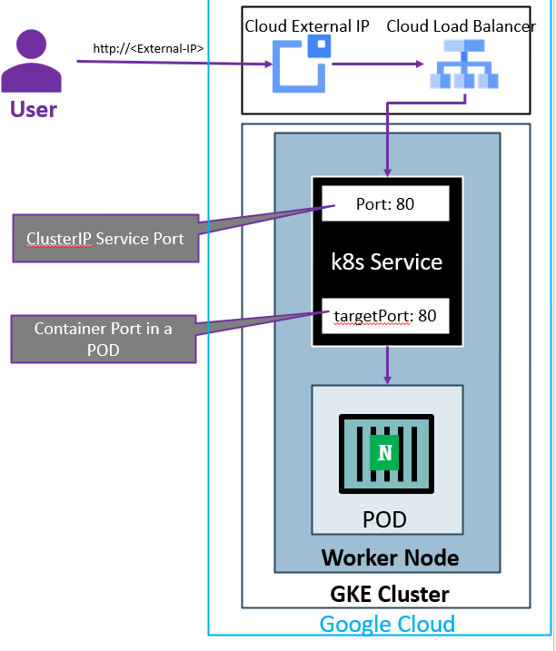

GKE Private Cluster - Understand technology like VPC peering, private IP, public IP, NAT gateway, firewall rules, etc.

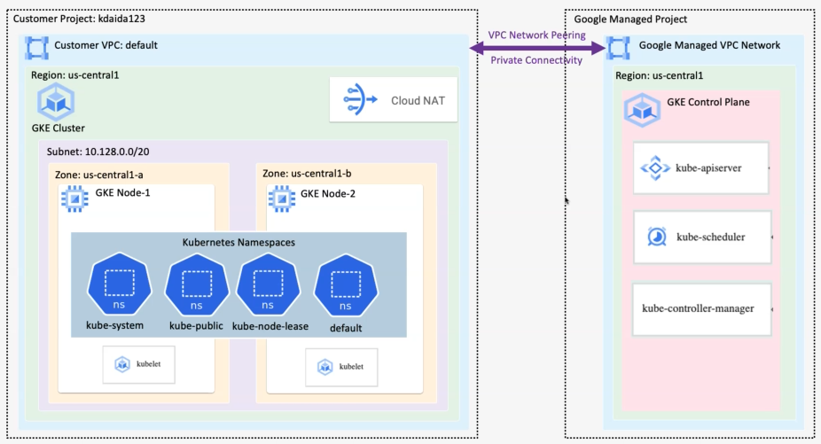

GKE Storage - Kubernetes storage concept - Understand about the storage classes, persistent volume, persistent volume claim, dynamic provisioning, etc. GCE persistent disk as a storage disk for implementation.

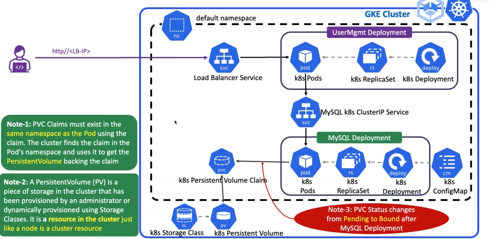

Implementation then we proceed with volume snapshot.

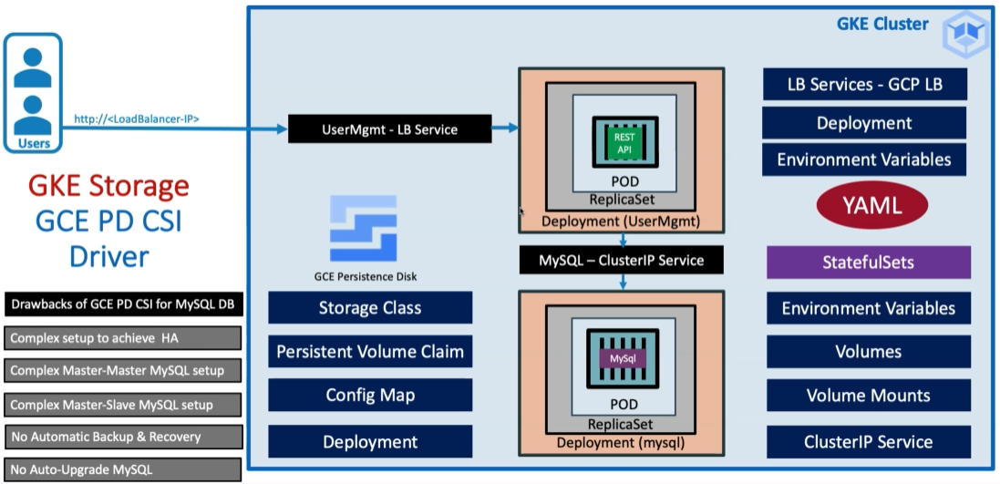

Use of the db Google cloud Cloud SQL and not the persistent disk CSI Driver.

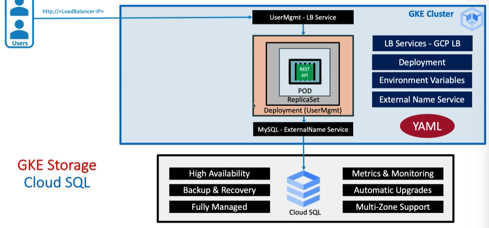

Then the next step to move with the GKE And Cloud SQL public IP.

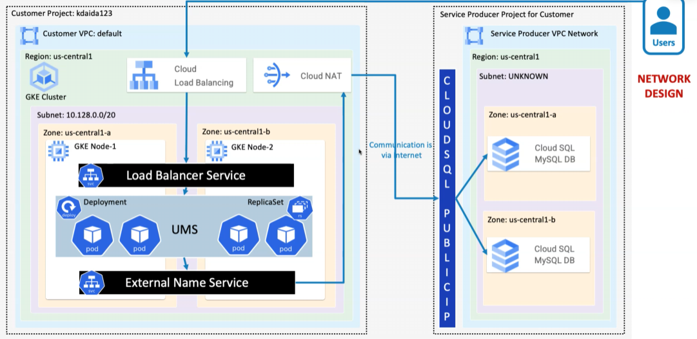

Then the next step to move with the GKE And Cloud SQL private service access.

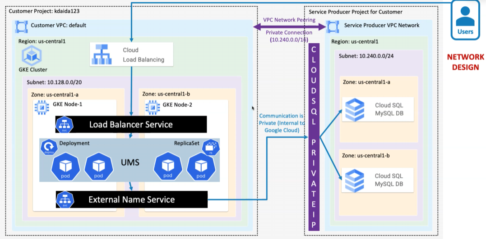


When it is done will proceed with FileStore and GKE, Volume restore.


Understand the Loadbalancer later - L4 and L7.

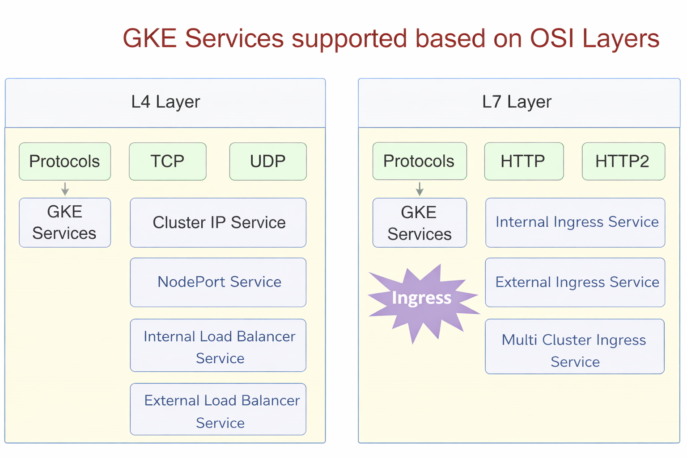
The ingress is a big topic.
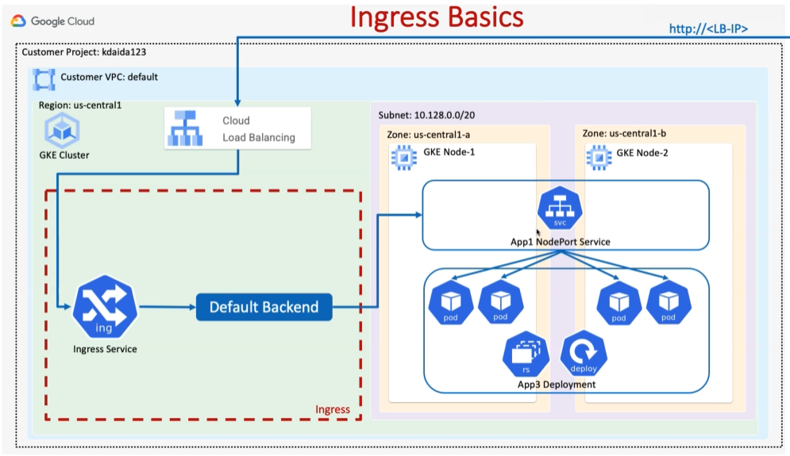

<br>

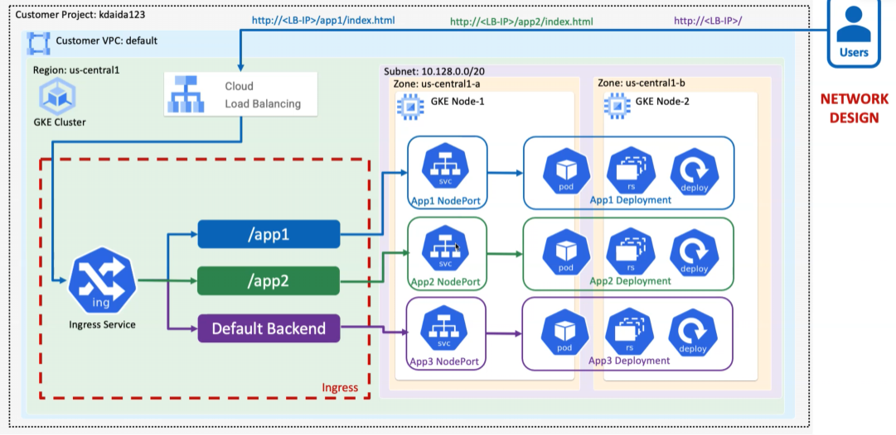

<br>

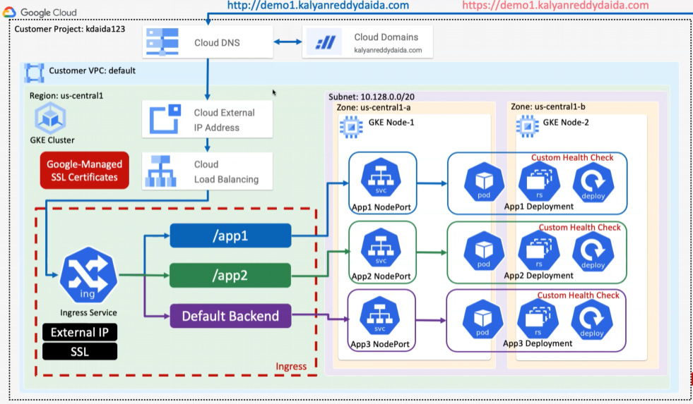
#### ReplicaSet.
There is no imperative command to create a replica set it is the declarative command.

Replica set helps in - Availability, Load Balancer, Scaling and Labels and Selectors.

A ReplicaSet’s purpose is to maintain a stable set of replica Pods running at any given time. In case application crashes (any pod dies), the replicaset will recreate the pod immediately to ensure the configured number of pods running at any given time.

ReplicaSet used to avoid overloading of traffic to single pod we can use load balancing. 

Kubernetes provides pod load balancing out of the box using **Services** for the pods which are part of a ReplicaSet. The services redirects the load to the specific pod. The Service is a TCP loadbalancer and to use HTTP routing, HTTP load balancing then we need to use ingress.

**Labels & Selectors** are the key items which tie all three together (Pod, ReplicaSet & Service). 

ReplicaSet Scaling. When load becomes too much for the number of existing pods, Kubernetes enables us to easily scale up our application, adding additional pods as needed.
This is going to be seamless and super quick.


```yaml
apiVersion: apps/v1
kind: ReplicaSet
metadata:
  name: my-helloworld-rs
  labels:
    app: my-helloworld
spec:
  replicas: 3
  selector: 
    matchLabels:
      app: my-helloworld
  template:
    metadata:
      labels:
        app: my-helloworld
    spec:
      containers:
      - name: my-helloworld-app
        image: stacksimplify/kube-helloworld:1.0.0

```

To deploy the replicaset in cmd `kubectl create -f replicaset-demo.yml` then see the name in `kubectl get replicaset`

`kubectl describe replicaset my-helloworld-rs` to see the details of the replicaset.

The `kubectl get pods` should show 3 pods. To see the owners of the pod get the name of any pod and `kubectl get pods <pod-name> -o yaml` the pod yaml will be showing of replicaset and the name. 

The next part to expose the ReplicaSet with a service (Load Balancer Service) to access the application externally (from internet)

```yaml
# Expose ReplicaSet as a Service
kubectl expose rs <ReplicaSet-Name>  --type=LoadBalancer --port=80 --target-port=8080 --name=<Service-Name-To-Be-Created>
kubectl expose rs my-helloworld-rs  --type=LoadBalancer --port=80 --target-port=8080 --name=my-helloworld-rs-service

# List Services
kubectl get service
kubectl get svc
# NAME                     TYPE           CLUSTER-IP     EXTERNAL-IP     PORT(S)          AGE
# kubernetes               ClusterIP      10.0.0.1       <none>          443/TCP          3d11h
# my-helloworld-rs-service LoadBalancer   10.0.10.62     34.28.33.243    80:31667/TCP     79s

# In the console workload section there is the load balancer with the IP.
```
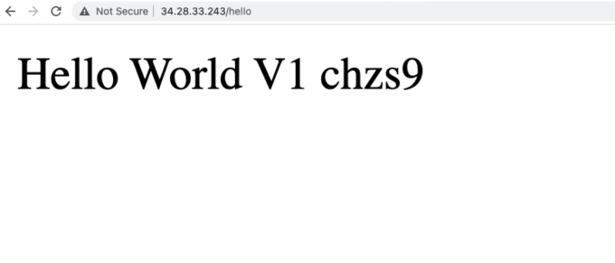
Each time we access the application, request will be sent to different pod and pods id will be displayed for us.

To test when delete any pod then it will create pod to maintain the replica value 3.
Delete the replicaset and the services.
```shell
kubectl delete rs my-helloworld-rs

# Verify if ReplicaSet got deleted
kubectl get rs

# Sample Commands
kubectl delete svc my-helloworld-rs-service

# Verify if Service got deleted
kubectl get svc
```

In console the workload and the service should be empty. 
#### Deployment.

Kubernetes Deployment in imperative way.
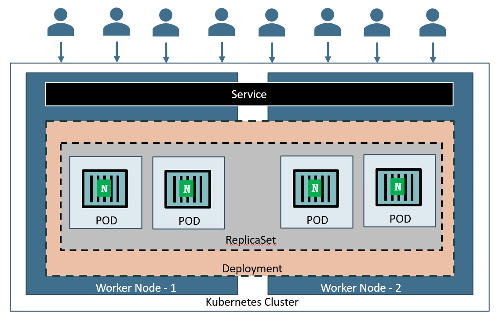

Inside the cluster worker node we have created the replicaset.   

The deployment is a superset of Kubernetes replicaset. The deployment in the API specification will have more features than replicaset.

The deployment use cases are shared.

Create a deployment to rollout a Replicaset.  
Update Deployment.  
Roll back to an earlier deployment revision.  
Scale up the deployment to facilitate more load.  
Pausing and resuming Deployment.  
Use the status of the deployment.  
Cleanup older replicaset in a deployment.  
Canary Deployment.


Create the deployment to rollout the Replicaset. Verify the deployment, replicaset and pods. 

When we create a deployment it will roll out a replicaset.
```yaml
# Create Deployment - In the terminal.
kubectl create deployment <Deplyment-Name> --image=<Container-Image>
kubectl create deployment my-first-deployment --image=stacksimplify/kubenginx:1.0.0 

# Verify Deployment
kubectl get deployments

# Describe Deployment
kubectl describe deployment <deployment-name>
kubectl describe deployment my-first-deployment

# Verify ReplicaSet
kubectl get rs

# Verify Pod
kubectl get po
# The describe -o yaml of the pod will show the value as Replicaset and it is the part of the deployment.
```
We have the rollout history, so we can switch back to older revisions using revision history.
```yaml
# Verify Rollout History
kubectl rollout history deployment/my-first-deployment
# deployment.apps/my-first-deployment
# REVISION  CHANGE-CAUSE
# 1         <none>
# Update REVISION CHANGE-CAUSE for Kubernetes Deployment
kubectl annotate deployment/my-first-deployment kubernetes.io/change-cause="Deployment CREATE - App Version 1.0.0"

# Verify Rollout History
kubectl rollout history deployment/my-first-deployment
# deployment.apps/my-first-deployment
# REVISION  CHANGE-CAUSE
# 1         Deployment CREATE - App Version 1.0.0
```
The text in the change-cause is the annotation and it will be displayed in the rollout history. It will help in tracking the deployment effectively.

#### Scale the deployment.

Scale the deployment to increase the number of replicas (pods). Till now in the `kubectl get pods` we see 1 pod.
```yaml
# Scale Up the Deployment
kubectl scale --replicas=10 deployment/<Deployment-Name>
kubectl scale --replicas=10 deployment/my-first-deployment 

# Verify Deployment
kubectl get deploy
# NAME                 READY   UP-TO-DATE   AVAILABLE   AGE
# my-first-deployment  10/10   10           10          7m59s
# It is 10/10 meaning 10 pods are running.

# Verify ReplicaSet
kubectl get rs

# Verify Pods
kubectl get po

# Scale Down the Deployment
kubectl scale --replicas=2 deployment/my-first-deployment 
kubectl get deploy
```
In the workload and inside the pods there will be 2 pods. 

Expose Deployment with a service (LoadBalancer Service) to access the application externally (from internet)

```yaml
kubectl get svc # No service is created yet.
#NAME         TYPE        CLUSTER-IP   EXTERNAL-IP   PORT(S)   AGE
#kubernetes   ClusterIP   10.0.0.1     <none>        443/TCP   4d4h

# Expose Deployment as a Service
kubectl expose deployment <Deployment-Name>  --type=LoadBalancer --port=80 --target-port=80 --name=<Service-Name-To-Be-Created>
# The target port is the container port.
kubectl expose deployment my-first-deployment --type=LoadBalancer --port=80 --target-port=80 --name=my-first-deployment-service

# service/my-first-deployment-service exposed.

# Get Service Info
kubectl get svc
# NAME                        TYPE           CLUSTER-IP   EXTERNAL-IP   PORT(S)          AGE
# kubernetes                  ClusterIP      10.0.0.1     <none>        443/TCP          4d4h
# my-first-deployment-service  LoadBalancer   10.0.4.167   34.66.8.33     80:30064/TCP     10s
```
In the browser the url `34.66.8.33` will show the application.

### Kubernetes Update Deployment.

We can update the deployment using 2 ways - Set image and Edit Deployment.
Updating Application version V1 to V2 using "Set Image" Option.  
Please Check the container name in spec.container.name yaml output and make a note of it and replace in kubectl set image command.
```yaml
# Get Container Name from current deployment
kubectl get deployment my-first-deployment -o yaml
# Get the name in spec.container.name

# Update Deployment - SHOULD WORK NOW
kubectl set image deployment/<Deployment-Name> <Container-Name>=<Container-Image> 
kubectl set image deployment/my-first-deployment kubenginx=stacksimplify/kubenginx:2.0.0

# Verify Rollout Status 
kubectl rollout status deployment/my-first-deployment
# deployment "my-first-deployment" successfully rolled out.

# Verify Deployment
kubectl get deploy
```
Verify the Events and understand that Kubernetes by default do "Rolling Update" for new application releases.
```yaml
# Describe Deployment
kubectl describe deployment my-first-deployment
#Events:
#  Type    Reason             Age   From                     Message
#  ----    ------             ----  ----                     -------
#  Normal  ScalingReplicaSet  23m   deployment-controller    Scaled up replica set my-first-deployment-556656d99 to 1
#  Normal  ScalingReplicaSet  16m   deployment-controller    Scaled up replica set my-first-deployment-556656d99 to 10 from 1
#  Normal  ScalingReplicaSet  14m   deployment-controller    Scaled down replica set my-first-deployment-556656d99 to 2 from 10
#  Normal  ScalingReplicaSet  88s   deployment-controller    Scaled up replica set my-first-deployment-96775f7f4 to 1
#  Normal  ScalingReplicaSet  85s   deployment-controller    Scaled down replica set my-first-deployment-556656d99 to 1 from 2 ### It changed from 1 to 2 meaning a new deployment will make a new then when its running it will make the latest. It is rolling update.
#  Normal  ScalingReplicaSet  84s   deployment-controller    Scaled up replica set my-first-deployment-96775f7f4 to 2 from 1
```
When we are updating an application it will create a new replicaset and do a rolling update.
```yaml

kubectl get rs
# NAME                          DESIRED   CURRENT   READY   AGE
# my-first-deployment-556656d99 0         0         0       26m
# my-first-deployment-96775f7f4 2         2         2       4m19s
kubectl get pods
# NAME                                READY   STATUS    RESTARTS   AGE
# my-first-deployment-96775f7f4-2xgvg 1/1     Running   0          4m39s
# my-first-deployment-96775f7f4-zx8tk 1/1     Running   0          4m35s
```

The pod is showing the hash of the new replicaset.  
```yaml
# Verify Rollout History
kubectl rollout history deployment/my-first-deployment
# Update REVISION CHANGE-CAUSE
kubectl annotate deployment/my-first-deployment kubernetes.io/change-cause="Deployment UPDATE - App Version 2.0.0 - SET IMAGE OPTION"

# Verify Rollout History
kubectl rollout history deployment/my-first-deployment
```
The Ip `34.66.8.33` will show the latest version.

Update the Application from V2 to V3 using "Edit Deployment" Option.  

```yaml
# Edit Deployment
kubectl edit deployment/<Deployment-Name> 
kubectl edit deployment/my-first-deployment

# Change From 2.0.0
spec:
  containers:
    - image: stacksimplify/kubenginx:2.0.0

# Change To 3.0.0
spec:
  containers:
    - image: stacksimplify/kubenginx:3.0.0
# Verify the version the history and the rollout status. The service IP should show the latest version.
```
### Rollback to previous version.

Rollback to previoud version and Rollback to specific version.

```yaml
# List Deployment Rollout History
kubectl rollout history deployment/my-first-deployment
# deployment.apps/my-first-deployment
# REVISION    CHANGE-CAUSE
# 1           Deployment CREATE - App Version 1.0.0
# 2           Deployment UPDATE - App Version 2.0.0 - SET IMAGE OPTION
# 3           Deployment UPDATE - App Version 3.0.0 - EDIT DEPLOYMENT OPTION
```

The change cause is not there then with `kubectl rollout history deployment/my-first-deployment --revision=3` we can see the changes.

The rollout to the previous version meaning the last version then the last version revision number should be 4 meaning the max version is the latest version.

```yaml
# Undo Deployment
kubectl rollout undo deployment/my-first-deployment

# List Deployment Rollout History
kubectl rollout history deployment/my-first-deployment
# deployment.apps/my-first-deployment
# REVISION  CHANGE-CAUSE
# 1         Deployment CREATE - App Version 1.0.0
# 3         Deployment UPDATE - App Version 3.0.0 - EDIT DEPLOYMENT OPTION
# 4         Deployment UPDATE - App Version 2.0.0 - SET IMAGE OPTION

kubectl get deploy
# NAME                 READY   UP-TO-DATE   AVAILABLE   AGE
# my-first-deployment  2/2     2            2           9m43s

kubectl get rs
# NAME                          DESIRED   CURRENT   READY   AGE
# my-first-deployment-556656d99 0         0         0       9m49s
# my-first-deployment-5d89c946f 0         0         0       6m44s
# my-first-deployment-96775f7f4 2         2         2       7m49s
```
There are 3 deployments so 3 replica sets and teh active has the pods.
The rollback to specific verion. `kubectl rollout undo deployment/my-first-deployment --to-revision=3` The latest number is 4 and with the rollback the revision 3 will be changed to the increase number 5.

The rolling restart of the application. The pod count is 2 so its easy to remove and restart and when there are 100 of pods then rolling restart command via deployment will be used. Rolling restarts will kill the existing pods and recreate new pods in a rolling fashion.

```yaml
# Rolling Restarts
kubectl rollout restart deployment/<Deployment-Name>
kubectl rollout restart deployment/my-first-deployment

# Get list of Pods
kubectl get po
# There is no downtime of the application and one will be terminated and the other will be created.
```
#### Pause and Resume the deployments.
When we want many changes in the deployment then pause and do the change and then deploy.
```yaml
# In the rollout version first see the deployment version.
# Pause the Deployment
kubectl rollout pause deployment/<Deployment-Name>
kubectl rollout pause deployment/my-first-deployment
# Update Deployment - Application Version from V3 to V4.

# When there is no pause then the set image will directly deploy the application.
kubectl set image deployment/my-first-deployment kubenginx=stacksimplify/kubenginx:4.0.0

# Check the Rollout History of a Deployment
kubectl rollout history deployment/my-first-deployment
# Observation: No new rollout should start, we should see same number of versions as we check earlier with last version number matches which we have noted earlier.

# Get list of ReplicaSets
kubectl get rs
# Observation: No new replicaSet created. We should have same number of replicaSets as earlier when we took note.

# Make one more change: set limits to our container
kubectl set resources deployment/my-first-deployment -c=kubenginx --limits=cpu=20m,memory=30Mi
```
Resume the deployment.
```yaml
# Resume the Deployment
kubectl rollout resume deployment/my-first-deployment

# Check the Rollout History of a Deployment
kubectl rollout history deployment/my-first-deployment  
# Observation: You should see a new version got created

# Update REVISION CHANGE-CAUSE
kubectl annotate deployment/my-first-deployment kubernetes.io/change-cause="Deployment PAUSE RESUME Demo - App Version 4.0.0 "

# Check the Rollout History of a Deployment
kubectl rollout history deployment/my-first-deployment

# Get list of ReplicaSets
kubectl get rs
# Observation: You should see new ReplicaSet.

# Get Load Balancer IP
kubectl get svc
```

Delete all the deployment and the services.
```yaml
kubectl get deploy
# NAME                 READY   UP-TO-DATE   AVAILABLE   AGE
# my-first-deployment  2/2     2            2           52m

kubectl delete deploy my-first-deployment
# deployment.apps "my-first-deployment" deleted
kubectl get svc
# NAME                         TYPE           CLUSTER-IP     EXTERNAL-IP      PORT(S)          AGE
# kubernetes                   ClusterIP      10.0.0.1       <none>           443/TCP          99m
# my-first-deployment-service   LoadBalancer   10.0.11.171    35.222.252.200   80:31950/TCP     52m
kubectl delete svc my-first-deployment-service
# service "my-first-deployment-service" deleted
```

### Kubernetes Service.

We have creates Kubernetes Service of type LoadBalancer to access the application externally. There are many services - ClusterIp Service, NodePort Service, Headless Service, LoadBalancer Service, ExternalName Service and Ingress Service.

Cluster IP (default): Used for internal communication between applications inside a Kubernetes cluster with a stable internal IP.

NodePort: Clients send requests to the IP address of a worker node on one or more nodePort values that are specified by the Service.

Ingress: An advanced load balancer that provides context path-based routing, SSL, SSL Redirect, and more — operates at HTTP Layer 7.

LoadBalancer: Primarily for Cloud Providers to integrate with their Load Balancers.

ExternalName: Internal clients use the DNS name of a Service as an alias for an external DNS name.

Headless: Used for discovering individual pods (especially Pod IPs), allowing another service to interact directly with the Pods instead of a proxy.

#### Cluster IP Service.

docs/images/ClusterIPService.png
Create a deployment for Backend Application (Spring Boot REST Application) Create a ClusterIP service for load balancing backend application.

```yaml
# Create Deployment for Backend Rest App
kubectl create deployment my-backend-rest-app --image=stacksimplify/kube-helloworld:1.0.0 
kubectl get deploy
# Create ClusterIp Service for Backend Rest App
kubectl expose deployment my-backend-rest-app --port=8080 --target-port=8080 --name=my-backend-service
# The cluster IP service port is 8080 and the service port is 8080.
kubectl get svc
# Observation: We don't need to specify "--type=ClusterIp" because default setting is to create ClusterIp Service. 
```

The frontend application is deployed as load balancer services. The backend service deployed name is my-backend-service. 

The frontend should use the name properly. In Nginx reverse proxy, ensure backend service name my-backend-service is updated when you are building the frontend container. We already built it and put ready for this demo (stacksimplify/kube-frontend-nginx:1.0.0)

```yaml
server {
    listen       80;
    server_name  localhost;
    location / {
    # Update your backend application Kubernetes Cluster-IP Service name  and port below      
    # proxy_pass http://<Backend-ClusterIp-Service-Name>:<Port>;      
    proxy_pass http://my-backend-service:8080;
    }
    error_page   500 502 503 504  /50x.html;
    location = /50x.html {
        root   /usr/share/nginx/html;
    }
}
```
The deployment for the frontend service.
```yaml
# Create Deployment for Frontend Nginx Proxy
kubectl create deployment my-frontend-nginx-app --image=stacksimplify/kube-frontend-nginx:1.0.0 
kubectl get deploy

# Create LoadBalancer Service for Frontend Nginx Proxy
kubectl expose deployment my-frontend-nginx-app  --type=LoadBalancer --port=80 --target-port=80 --name=my-frontend-service
kubectl get svc

# Get Load Balancer IP
kubectl get svc
http://<External-IP-from-get-service-output>/hello
curl http://<External-IP-from-get-service-output>/hello

# Scale backend with 10 replicas
kubectl scale --replicas=10 deployment/my-backend-rest-app

# Test again to view the backend service Load Balancing
http://<External-IP-from-get-service-output>/hello
curl http://<External-IP-from-get-service-output>/hello
```

When done then delete the svc and the deployments.

### Kubernetes Pod manifest in yaml - declarative.
The main parts in the yaml - apiVersion, kind, metadata and spec.

In the Kubernetes documents like API refrence we will see Workload Reference and there are many workloads - Pod, ReplicaSet, Deployment, StatefulSet, DaemonSet, Job and CronJob. The point to create the pod so will see the pod reference.

```yaml
apiVersion: v1 # The api group need to see the latest in the Kubernetes API reference.
kind: Pod
metadata:
    name: my-first-pod
    labels: 
        app: myapp-pod
spec:
    containers: 
        name: my-first-pod-container
        image: stacksimplify/kubenginx:1.0.0
        ports:
            containerPort: 80
```
The pods are not created individually the deployment is created and it will create the pod.

### Kubernetes Load Balancer Service manifest in yaml - declarative.

```yaml
apiVersion: v1
kind: Service       
metadata:
  name: myapp-pod-loadbalancer-service
spec:
  type: LoadBalancer
  selector:
    app: myapp-pod    
  ports:
    - name: http
      port: 80 # Service Port.
      targetPort: 80 # Container port.
```

The selector - It routes service traffic to the pods with the label and key value matching the selector. 
When we create a loadbalancer service it will create the external IP address and when a request to the service it should be directed to the pod and selector will tell the pod name.
The pod label that is created is in the selector app.

### Kubernetes ReplicaSet manifest in yaml - declarative.

```yaml
apiVersion: apps/v1
kind: ReplicaSet
metadata: # Dictionary
  name: myapp2-rs
spec: # Dictionary
  replicas: 3
  selector:
    matchLabels:
      app: myapp2
  template:
    metadata: # Dictionary
      name: myapp2-pod
      labels: # Dictionary
        app: myapp2  # Key value pairs
    spec:
      containers: # List
        - name: myapp2-container
          image: stacksimplify/kubenginx:2.0.0
          ports:
            - containerPort: 80
```