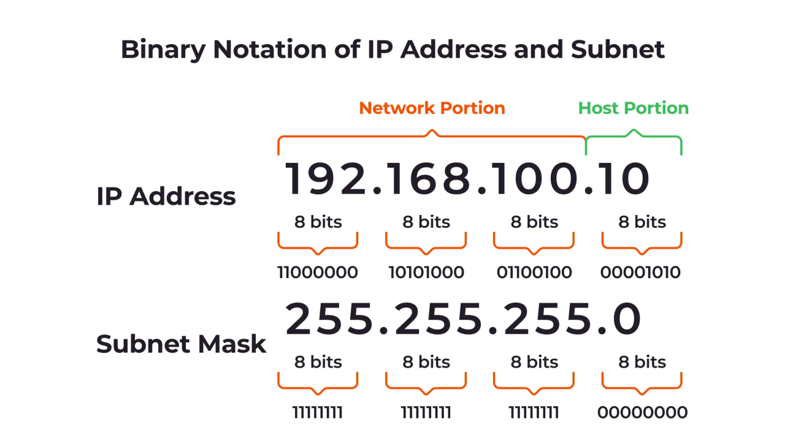

IP Address - The unique address assigned to a device on a network.

Example - There is Wifi and 4 devices connected to the WIFI and say one of the device should not have instagram and youtube access then using the IP address we can make the connection.

To generate the IP address the IPv4 standard is used to get the IP address. There are say 10k students in a college and the standard should be followed to maintain the IP address. The IPv4 standard make the IP like 10.1.20.10 and the command to see the IP address is "ipconfig" in windows and "ifconfig" in linux. 

The total range will be 10.1.20.10 and the range 0-255. The total range devices it will manage 0...255 * 0...255 * 0...255 * 0...255 = 4,294,967,296 devices will have the unique IP address. The IP address is divided into 4 octets and each octet is represented by 8 bits. 

The first octet represents the network portion, the second octet represents the subnet portion, and the last two octets represent the host portion.

When we get the VM instance in GCP then we see the IP address assigned to the instance.

### Subnet.

The application using the VPC (private network) in GCP and asking the network provider that I need 65k IP addresses. The cloud provider gave the range of the Ip and it is given to the company.

The application has the group of the device and one person used a malicious website and the hacker has the access to the device. The device is part of the group and teh hacker has the access to the group. It is not safe so there is subnet meaning sub networking.

The Finance team is in separate network and HR in separate network. The team network is the subnetting and it gives security, privacy.

There are 2 types - Private Subnet (The subnet that doesnot have connection to internet) and Public Subnet(the subnet that has connection to internet). The private subnet is used for the internal communication and the public subnet is used for the external communication.

The public subnet has the access to the internet and in AWS there we give the routetables to the subnet and the route table has the route to the internet gateway. The private subnet has the route to the NAT gateway and the NAT gateway has the route to the internet gateway. The NAT gateway is used to give the access to the internet for the private subnet.

The application how they determine the subnet like Finance team has 10k device and HR team has 256 device - When we create the subnet we need to give the range of the IP address and the range is given in CIDR notation. The CIDR is the Classless Inter-Domain Routing and it is used to allocate the IP address and routing.

GCP - VPC - Subnet and with in the Subnet give the CIDR (172.16.3.0/24) when it need 256 device then the CIDR is /24.
The IP range 172.16.0.0  - 172.16.255.255 the range is in total and the 256 computer needs a separate group. The IP is the 4 octet meaning 8 bits in each octet meaning total 32 bits and the last part range 0 - 255 meaning it will cover the last octet and the first 3 octet can be fixed.

--------|--------|--------|--------|
0-255 | 0-255 | 0-255 | 0-255

The target to get 256 different number then the last octet should be different.
Easy way = 32-24 = 8 bit meaning 2^8 = 256 so the last octet will be different and the first 3 octet will be fixed. The CIDR is /24 meaning 24 bits are fixed and the last 8 bits are different. 
The CIDR can be 172.16.3.0/24 or 172.16.4.0/24 or 172.16.225.0/24 The first part will be fixed and the last part will be different.

There is a need 2 computer should make a subnet then the CIDR 172.16.3.0/31 meaning (32-31 = 1) 31 bits will be same and the 1 bit will be different. The one bit can have 0 or 1 value so 2 computers.

The subnet needs 32 computers meaning 2^5 is 32 then the IP should have the (32-5 = 27) bits fixed and the last 5 different. The CIDR will be /27.

The CIDR /8 meaning 32-8 = 24 there will be 2^24 computers. It is called Class A.

/8 = Class A.  
/16 = Class B.  
/24 = Class C.

/30 meaning 32-30 = 2 meaning 2^2 = 4 computers.
/29 meaning 32-29 = 3 meaning 2^3 = 8 computers.

In order to get 5 different computers in the subnet meaning 2^2 = 4 (4<5) and 2^3 = 8.
32-3 = 29 meaning 29 bits will be fixed and the last 3 bits will be different. The CIDR will be /29.

In general the private subnet Ip starts with 192, 172, 10. The public subnet Ip starts with 8, 9, 1, 2, 3, 4, 5, 6, 7.

The 8.8.8.8 is the public DNS server provided by Google.

### Ports.

When an application is deployed in the VM the application gets a port. To access the application we need the IP address of the VM and the port number.

### OSI Model.
The OSI model gives the details of the journey of the data and the layer.

**What happens when you hit google.com?**

The first thing that happens is the DNS resolution and the TCP handshake.
The browser hit the google.com and the wifi router will see in case the url mapped to any IP address. The router has the DNS table and it map the domain name to the IP address.
The router search in the local cache. In case not then the router goes to the ISP and the ISP has the DNS table and it will search in the local cache. In case not then the ISP goes to the root DNS server and the root DNS server has the list of all the TLD (Top Level Domain) and it will search for .com and it will give the IP address of the .com DNS server. The ISP will go to the .com DNS server and it will search for google.com and it will give the IP address of google.com. The ISP will give the IP address to the router and the router will give the IP address to the browser. 

The next step is teh TCP handshake. The browser will make a TCP connection with google.com using 3 way handshake. The browser get the Ip address of google to send the data it should first see the server or the google is ready to take any request.
The TCp handshake is the process of establishing a TCP connection between a client and a server. It involves three steps - The client sends a **SYN** (synchronize) packet to the server, the server responds with a **SYN-ACK** (synchronize-acknowledge) packet, and the client sends an **ACK** (acknowledge) packet back to the server. This process ensures that both the client and server are ready to communicate and establishes a reliable connection for data transfer.

When the TCP connection is established, the browser initiates an HTTPs request to the server, and the server responds with an HTTPs response. The request is https so it the https request in case of FTP then it will be FTP. It is the L7 layer Application layer.

The next step is the data encryption. The Https meaning the data encryption and formatting and it is L6 layer Presentation layer.

The browser creates a session and it is L5 layer Session layer. The session is created between the client and the server and it is used to maintain the state of the communication. It is very important in case of the web application where the user is logged in and the session is maintained. In case of Banking application and you send the amount and the session is one min then it will be logged out and the transaction will be failed. The session is maintained when the user is logged in.

The L7, L6 and the L5 are done by the browser.

The next step is the data segmentation and it is L4 layer Transport layer. The data is segmented into smaller chunks and each chunk is assigned a sequence number. The sequence number is used to reassemble the data at the destination. The transport layer also provides error detection and correction. the segment of the data are transported with the TCP or UDP protocol.

The next step is the data routing and it is L3 layer Network layer. The data is routed from the source to the destination based on the IP address. The network layer also provides logical addressing and routing. The data will have the source IP address and the destination IP address. The data will be routed based on the destination IP address. The data in this layer is called the packets.

The next step is the data framing and it is L2 layer Data Link layer. The data is framed into smaller units called frames. The frames are used to transmit the data over the physical layer. The data link layer also provides error detection and correction. The data in this layer is called the frames. The router is connected to switches and the ethernet port and it is connected to the cable and the data has to travel from the packets to the frames. The data link layer is responsible for the physical addressing and the data will have the source MAC address and the destination MAC address. The data will be routed based on the destination MAC address. The packet cannot be send as switch work in frame and the router work in packet. 

The next step is the data transmission and it is L1 layer Physical layer. The router is connected to the optic cable. The data is transmitted over the physical medium such as copper wire, fiber optic cable, or wireless. The optical cable only understand electric signals. The physical layer also provides the electrical and mechanical specifications for the physical medium. The data in this layer is called the bits. The data will be transmitted as bits over the physical medium.

Layer|Work|
---|---|
L7|Https
L8|Encryption
L5|Session
L4|Segmentation(It is based on the TCP/UDP).
L3|Router(IP address packets).
L2|Data converted to frames (MAC address).
L1|Physical Layer (Switches are connected to the optical cable and data is converted to electric signals).

When sending the request the data movement is L7 to L1 and the receiver will be taking from L1 to L7.

